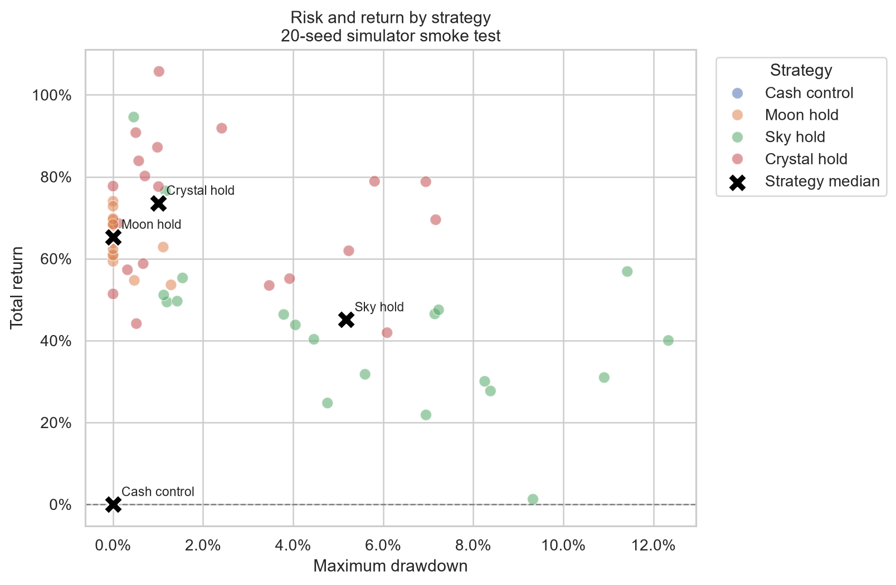

# 星落交易所 Starfall Exchange

一个浏览器内运行的放置交易游戏原型，也是我的游戏系统与数值策划作品。玩家选择商会、买入能产生经营回款的公司、配置自动委托，在 12 个市场日后结算并用声望解锁下一轮内容。

**当前阶段：可玩的 v0.5 原型。** 它展示了系统设计和初步数值分析；玩家体验与整体平衡仍待验证。

## 快速查看

1. 下载整个仓库。Windows 用户双击 `START_GAME.cmd`，浏览器会打开本地试玩页。游戏无需登录或服务器账号。
2. 进入后保持默认的约 3 分钟试玩速度，选择商会、买入股票，尝试自动委托和商会信箱；第 12 日结束时会生成轮回报告。
3. 其他系统可在项目根目录运行本地静态文件服务器，例如 `python -m http.server 18765`，再访问 `http://127.0.0.1:18765/`。直接双击 `index.html` 可能受浏览器模块加载限制。

更详细的试玩说明见 [PLAYTEST_GUIDE.md](PLAYTEST_GUIDE.md)，规则基线见 [DESIGN.md](DESIGN.md)。

## 我想解决的问题

交易玩法往往要求玩家盯盘，放置玩法又可能在配置完成后缺少判断。我把“先形成判断，再交给系统执行”作为核心：玩家决定持有哪些公司、在什么条件下自动交易；市场继续运行，并显示价格变化的来源。

当前原型包含 6 支机制不同的公司、3 个商会、36 个词条、4 条构筑路线、自动委托、经营回款和跨轮成长。游戏内顾问只读取状态并提供规则建议，不能直接交易或修改资产。

## 一次可复现的数值实验

我用 20 个共同随机种子比较首局 4 种策略：全程现金，以及分别持有三支初始股票。共生成 80 轮模拟、1,040 条逐日记录和 6,240 条股票日记录。数据、实验设定和风险收益图放在 [`analysis/smoke-20-seeds`](analysis/smoke-20-seeds)。

这轮实验暴露了部分资产的风险收益表现不匹配，帮助确定下一轮调参方向。**它只是模拟器冒烟实验**：没有覆盖完整构筑、自动委托和真实玩家行为，不能据此声称游戏已经平衡。复盘和已知问题见 [PROJECT_RETROSPECTIVE.md](PROJECT_RETROSPECTIVE.md)。



## 工程结构

| 路径 | 内容 |
| --- | --- |
| `index.html`、`app.mjs`、样式文件 | 浏览器试玩界面 |
| `src/` | 市场、交易、轮回、商会词条、自动策略、存档与模拟器规则 |
| `scripts/run-minimal-experiment.mjs` | 使用正式规则批量运行上述实验 |
| `tests/` | 规则与模拟器自动测试 |
| `analysis/smoke-20-seeds/` | 初步实验数据与图 |

核心游戏使用原生 JavaScript 模块，没有 npm 依赖。运行测试需要 Node.js：

```bash
node --test --test-isolation=none tests/*.test.mjs
```

重新生成实验数据：

```bash
node scripts/run-minimal-experiment.mjs
```

默认输出到 `analysis/generated/`，该目录不会纳入 Git。也可以在命令末尾传入自定义输出目录。

## 我的职责与协作边界

我主导玩法定位、规则设计、数值假设、实验问题、结果判断和验收；使用 Codex 辅助 JavaScript 实现、测试脚手架及部分文档整理。仓库保留代码与数据，方便面试时直接说明每个判断的依据和局限。
